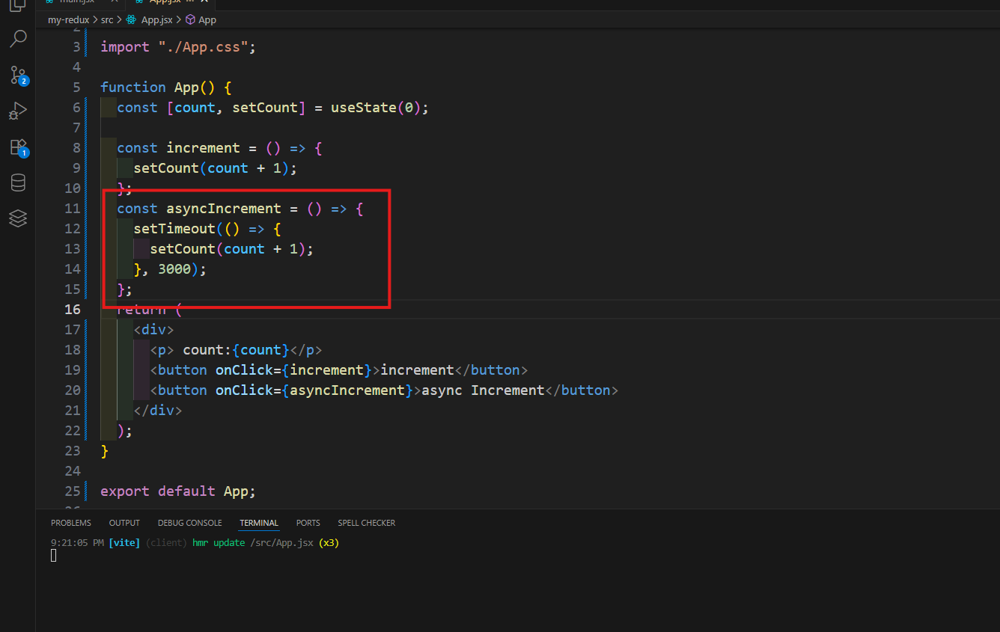

## Fundamentals of State Management
## 20-1 What is State? Understanding the Core of UI Logic

 ##### What is State?
State refers to the data or information that determines the behavior and appearance of a user interface at a given time.

In simple terms:

 State is like memory for your UI.
It stores values that can change over time, such as user input, fetched data, or UI toggles.

## 20-2 How State Triggers Renders in React
```html
 <!DOCTYPE html>
 <html lang="en">
 <head>
    <meta charset="UTF-8">
    <meta name="viewport" content="width=device-width, initial-scale=1.0">
    <title>Document</title>
     <script src="https://cdn.jsdelivr.net/npm/@tailwindcss/browser@4"></script>
 </head>
 <body>
  <div
  class="flex item-center justify-center min-h-screen  gap-2 bg-gray-100">
  <div class="flex items-center gap-6 bg-white p-8  rounded-lg shadow-lg">
 <button 
 id="Increment"
 class="px-4 py-2 bg-green-500 items-center gap-6  p-8  rounded-lg shadow-lg">Increment</button>
 
  <span id="count" class="text-3xl w-12">0</span>
 <button 
 id="Decrement"
 class="px-4 py-2 bg-red-500 items-center gap-6  p-8  rounded-lg shadow-lg">Decrement</button>
  </div>
  
 
   </div>
 <script src="script.js"></script>
 </body>
 </html>
 ```

```js
let count = 0; // state

const render=()=>{
     document.getElementById("count").innerHTML=count
}

const increment = () => {
  count++;
  render()
};
const decrement = () => {
  count--;
  render()
};
render()
document.getElementById("Increment").addEventListener("click", increment);
document.getElementById("Decrement").addEventListener("click", decrement);
```

## 20-3 React State & Re-Renders: Stateless vs Stateful
🧠 1. What is React State?
State is a built-in object used to hold dynamic data in a component. When the state changes, React re-renders the component to reflect the updated data.
```js
const [count, setCount] = useState(0);
```
count is the current state value.

setCount is the function to update the state.

Changing state causes the component to re-render.

🔁 2. Re-Renders in React
Whenever a component’s state or props change, React re-renders it.

Re-render means React calls the component function again.

The virtual DOM is then used to efficiently update the real DOM.

Re-render is not reload. It’s a lightweight update.

🆚 3. Stateless vs Stateful Components
Feature	Stateless Component	Stateful Component
Holds state?	❌ No	✅ Yes
Re-renders on state?	❌ Doesn’t have state, so no	✅ Re-renders when state updates
Example	Pure UI, no internal logic	Has logic to manage internal changes
Use case	Display-only components	Interactive components

✅ Stateless Component Example
```js
function Greeting({ name }) {
  return <h1>Hello, {name}</h1>;
}
```
Pure function.

No internal state.

Renders based only on props.

✅ Stateful Component Example
```js
import { useState } from 'react';

function Counter() {
  const [count, setCount] = useState(0);

  return (
    <>
      <p>Count: {count}</p>
      <button onClick={() => setCount(count + 1)}>Increase</button>
    </>
  );
}
```
Uses useState.

Internal state drives UI.

Re-renders on state change.
## 20-5 React Reconciler & Fiber Explained Simply
 1. What is React Reconciler?
The React Reconciler is the part of React that decides:

"What changed in your app, and how should I update the screen?"

Whenever you update your state (like using setCount), React doesn’t blindly re-render everything.

Instead, it asks:

“What changed? Only update that part.”

That smart comparison and update decision-making is done by the Reconciler.

#### 2. What is Fiber?
Fiber is the new version of the Reconciler introduced in React 16+.

Fiber makes React smarter, faster, and more flexible.

 #### Why Fiber was needed:
Before React 16 (old reconciler), React updated everything in one go — big updates could block the browser and freeze the UI.

With Fiber, React:

✅ Breaks work into smaller chunks
✅ Can pause work
✅ Can resume work
✅ Gives priority to more important updates
✅ Makes UI smoother, especially on slow devices

📖 Simple Example:
Imagine you're reading a book (rendering your app).
Old React read the whole book in one go. No break. No stop.

But with Fiber, React says:

"I’ll read one page at a time, take breaks if needed, and read the important pages first if there’s something urgent."

That’s what Fiber does — smart, interruptible work.

✅ Fiber vs Old Reconciler
Feature	Old React (Stack Reconciler)	New React (Fiber)
Rendering style	All at once	Piece by piece (chunked)
Can pause work	❌ No	✅ Yes
Can prioritize tasks	❌ No	✅ Yes
Performance	Slower	Faster and smoother
Supports async UI	❌ No	✅ Yes (e.g., Suspense, Lazy loading)

🎯 Why Fiber is Important:
Smooth UI even when devices are slow

Async rendering (used in Concurrent Mode in React 18+)

Supports cool features like Suspense, Lazy loading

Helps React grow with new advanced features

🔁 Recap:
Term	Meaning
Reconciler	React’s decision-maker – what changed and what to update
Fiber	A new, smart Reconciler system
Benefit	Breaks tasks, pauses/resumes rendering, prioritizes work
Real-world	Like reading a book page-by-page instead of in one go

## 20-6 Synchronous vs Asynchronous Behavior of useState


this async  function when i runed the problem is you faces when you trigger increment and also click asyncDecrement function when asyncDecrement function hitting you first increment will be show re rendering
the solution is 
```js
 setCount((prevCount)=>prevCount +1);
 ```
 right now he not receive actual he count receive  on memory
```js
import { useState } from "react";

import "./App.css";

function App() {
  const [count, setCount] = useState(0);

  const increment = () => {
    setCount(count + 1);
  };
  const asyncIncrement = () => {
    setTimeout(() => {
      setCount((prevCount)=>prevCount +1);
    }, 3000);
  };
  return (
    <div>
      <p> count:{count}</p>
      <button onClick={increment}>increment</button>
      <button onClick={asyncIncrement}>async Increment</button>
    </div>
  );
}

export default App;
```
## 20-7 What Are Signals? The Future of Reactive State

#### what is signal? 
- Signal is also a state. Its not just a normal state. rather its a reactive state. 
- signal is consist of two things 
  1. Getter 
  2. Setter 
- When we take value from a state we call it pure value but In signal we do not get pure value. rather we call `Getter` and the getter gives us the value.
- The facility of this is called `Fine-Grained Reactivity`. 
- When a state changes in regular react app entire component changes.
- But If we use signal it just changes the specific element that is supposed to change.
- In nowadays we do not use signals with react. but in Future it will come soon.
- In vue the signal is called Ref [Signal In Vue](https://vuejs.org/api/reactivity-core.html#ref)
- Using Preact we can use the signal but is not that stable
- The concept of signal came from solid.js [signal Concept](https://www.solidjs.com/guides/getting-started)

```jsx
const [first, setFirst] = createSignal("JSON");
const [last, setLast] = createSignal("Bourne");

createEffect(() => console.log(`${first()} ${last()}`));
```
- Here first is getter
## 20-8 Using Objects as State in React: Gotchas & Best Practices
- when a input field is not hooked with react state that is called uncontrolled input. Otherwise its controlled.  

```js
import { useState } from "react";

function App() {
  const [name, setName] = useState("");
  const [email, setEmail] = useState("");
  const [phone, setPhone] = useState("");

  const handleSubmit = (e) => {
    e.preventDefault();
    console.log({ name, email, phone });
  };

  return (
    <div>
      <form onSubmit={handleSubmit}>
        <div>
          <label htmlFor="name">Name</label><br />
          <input
            type="text"
            name="name"
            id="name"
            value={name}
            onChange={(e) => setName(e.target.value)}
          />
        </div>
        <div>
          <label htmlFor="email">Email</label><br />
          <input
            type="email"
            name="email"
            id="email"
            value={email}
            onChange={(e) => setEmail(e.target.value)}
          />
        </div>
        <div>
          <label htmlFor="phone">Phone</label><br />
          <input
            type="tel"
            name="phone"
            id="phone"
            value={phone}
            onChange={(e) => setPhone(e.target.value)}
          />
        </div>
        <div>
          <button type="submit">Submit</button>
        </div>
      </form>
    </div>
  );
}

export default App;

```

- lets centralize the user Inputs 

```js 
import { useState } from "react";

function App() {
  const [userInfo, setUserInfo] = useState({
    name: "",
    email: "",
    phone: ""
  });

  const userInfoUpdate = (value) => {
    setUserInfo(value)
  }

  const handleSubmit = (e) => {
    e.preventDefault();
    console.log(userInfo);
  };

  return (
    <div>
      <form onSubmit={handleSubmit}>
        <div>
          <label htmlFor="name">Name</label><br />
          <input
            type="text"
            name="name"
            id="name"
            value={userInfo.name}
            onChange={(e) => userInfoUpdate(e.target.value)}
          />
        </div>
        <div>
          <label htmlFor="email">Email</label><br />
          <input
            type="email"
            name="email"
            id="email"
            value={userInfo.email}
            onChange={(e) => userInfoUpdate(e.target.value)}
          />
        </div>
        <div>
          <label htmlFor="phone">Phone</label><br />
          <input
            type="tel"
            name="phone"
            id="phone"
            value={userInfo.phone}
            onChange={(e) => userInfoUpdate(e.target.value)}
          />
        </div>
        <div>
          <button type="submit">Submit</button>
        </div>
      </form>
    </div>
  );
}

export default App;

```

- There is a problem the objet is being muted by the last value. Means the phone number is replacing the entire object. Mutation is happening. 
- In Redux we have to deal with this too
- Lets deal the mutation here. 

```jsx
import { useState } from "react";

function App() {
  const [userInfo, setUserInfo] = useState({
    name: "",
    email: "",
    phone: ""
  });

  const userInfoUpdate = (input, value) => {
    setUserInfo({ ...userInfo, [input]: value })
  }

  const handleSubmit = (e) => {
    e.preventDefault();
    console.log(userInfo);
  };

  return (
    <div>
      <form onSubmit={handleSubmit}>
        <div>
          <label htmlFor="name">Name</label><br />
          <input
            type="text"
            name="name"
            id="name"
            value={userInfo.name}
            onChange={(e) => userInfoUpdate(e.target.name, e.target.value)}
          />
        </div>
        <div>
          <label htmlFor="email">Email</label><br />
          <input
            type="email"
            name="email"
            id="email"
            value={userInfo.email}
            onChange={(e) => userInfoUpdate(e.target.name, e.target.value)}
          />
        </div>
        <div>
          <label htmlFor="phone">Phone</label><br />
          <input
            type="tel"
            name="phone"
            id="phone"
            value={userInfo.phone}
            onChange={(e) => userInfoUpdate(e.target.name, e.target.value)}
          />
        </div>
        <div>
          <button type="submit">Submit</button>
        </div>
      </form>
    </div>
  );
}

export default App;

```

- basically for this kind of object input fields useReducer is mostly used. Redux used to use useReducer Earlier. 
