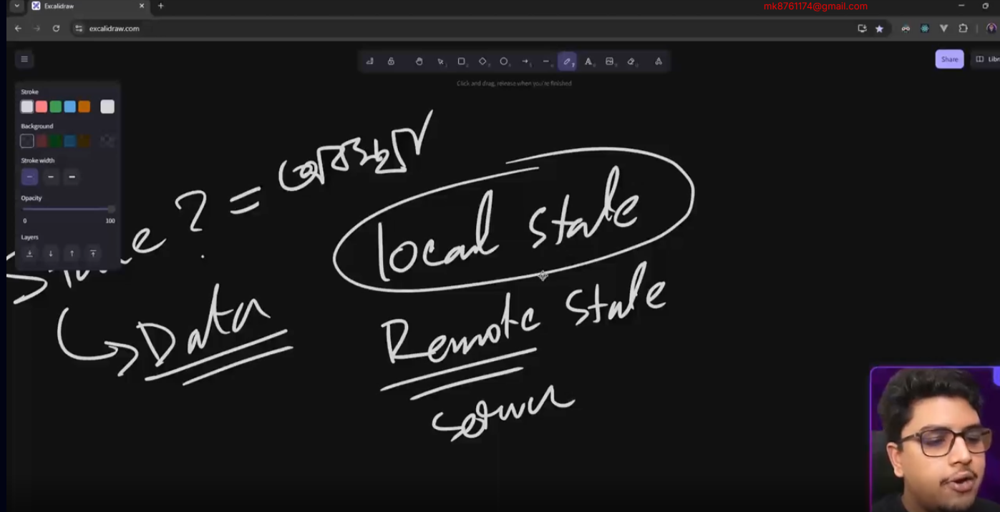

## Fundamentals of State Management
## 20-1 What is State? Understanding the Core of UI Logic

 ##### What is State?
State refers to the data or information that determines the behavior and appearance of a user interface at a given time.

In simple terms:

 State is like memory for your UI.
It stores values that can change over time, such as user input, fetched data, or UI toggles.

## 20-2 How State Triggers Renders in React
```html
 <!DOCTYPE html>
 <html lang="en">
 <head>
    <meta charset="UTF-8">
    <meta name="viewport" content="width=device-width, initial-scale=1.0">
    <title>Document</title>
     <script src="https://cdn.jsdelivr.net/npm/@tailwindcss/browser@4"></script>
 </head>
 <body>
  <div
  class="flex item-center justify-center min-h-screen  gap-2 bg-gray-100">
  <div class="flex items-center gap-6 bg-white p-8  rounded-lg shadow-lg">
 <button 
 id="Increment"
 class="px-4 py-2 bg-green-500 items-center gap-6  p-8  rounded-lg shadow-lg">Increment</button>
 
  <span id="count" class="text-3xl w-12">0</span>
 <button 
 id="Decrement"
 class="px-4 py-2 bg-red-500 items-center gap-6  p-8  rounded-lg shadow-lg">Decrement</button>
  </div>
  
 
   </div>
 <script src="script.js"></script>
 </body>
 </html>
 ```

```js
let count = 0; // state

const render=()=>{
     document.getElementById("count").innerHTML=count
}

const increment = () => {
  count++;
  render()
};
const decrement = () => {
  count--;
  render()
};
render()
document.getElementById("Increment").addEventListener("click", increment);
document.getElementById("Decrement").addEventListener("click", decrement);
```